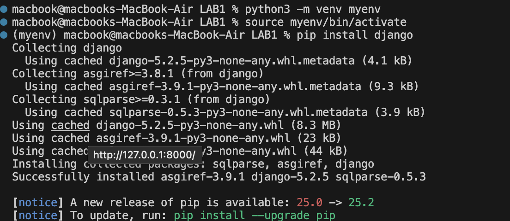
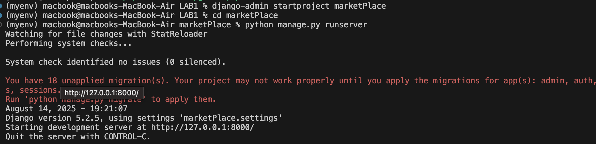
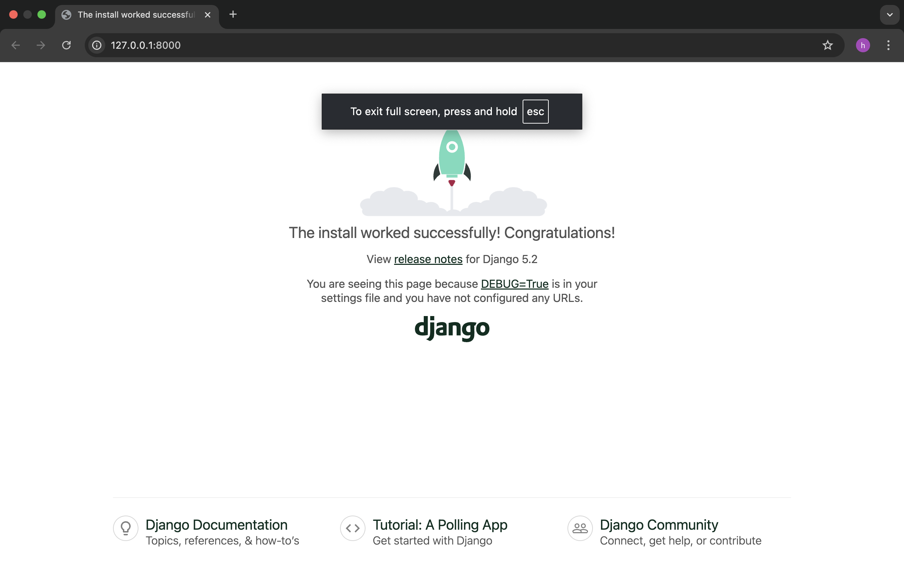
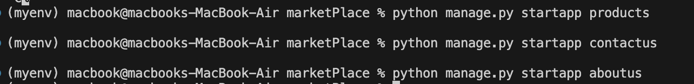
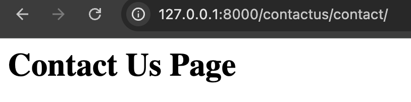
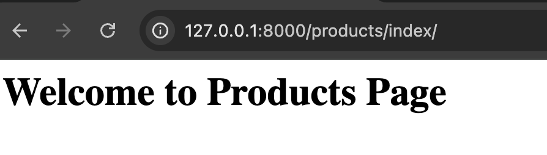

# lab1 #
# **📌Problem 1:
## install django

📸

# **📌Problem 2:**
## create project marketplace

📸

📸

# **📌Problem 3:**

## create 3 applications products, contactus, aboutus in each application create one page                                                            -> add url products/index contactus/contact aboutus/about

