# lab3 #
# **📌Problem 1:
## Run the container hello-world

📸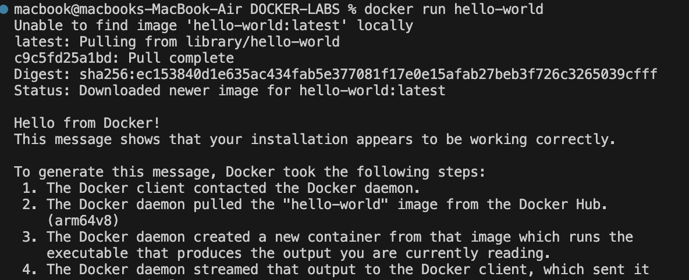

## Check the container status

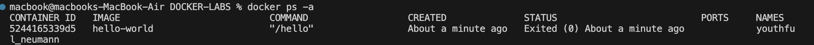

## Remove the container
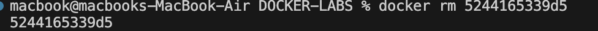

## Remove the image
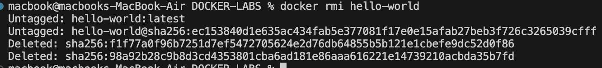

# **📌Problem 2:**
## Run container centos or ubuntu in an interactive mode

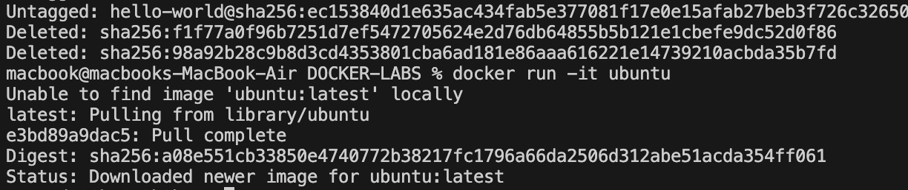

## Run the following command in the container “echo docker ”

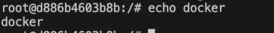

## Open a bash shell in the container and touch a file named hello-docker

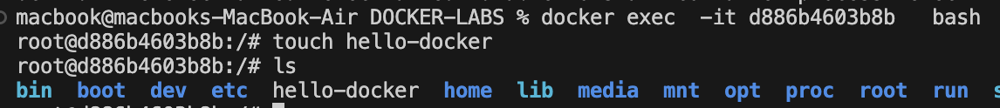

## Stop the container and remove it. Write your comment about the file hello-docker

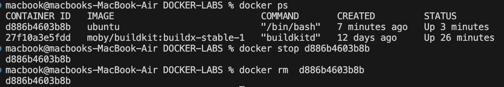

the file will removed also 

## Remove all stopped containers

# **📌Problem 1:**

## Deploy a MySQL database called app-database. Use the mysql latest image, and use the -e flag to set MYSQL_ROOT_PASSWORD to P4sSw0rd0!. The container should run in the background.

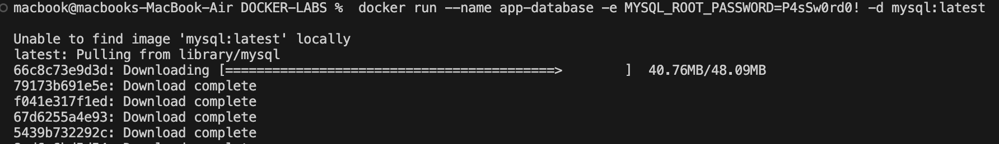

# **📌Problem 4:**

##  Run the image Nginx

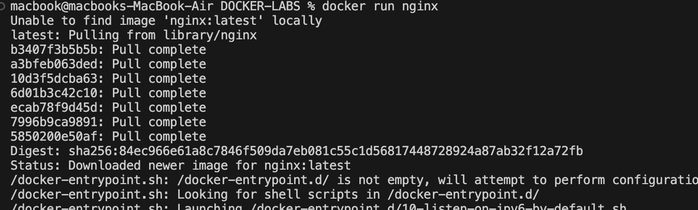

## Add html static files to the container and make sure they are accessible

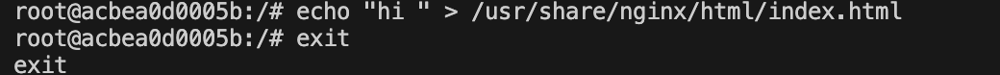
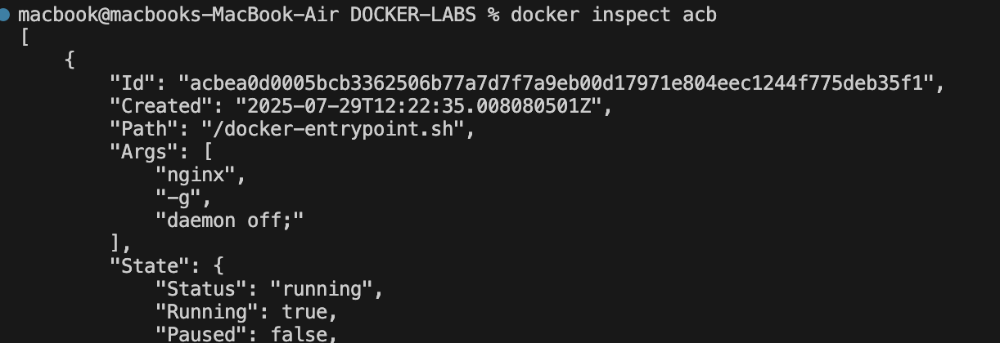

# **📌Problem 5:**

## Run a container Nginx with name mynginx and attach a volume for containing static html file

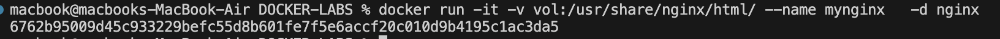

## Remove the container

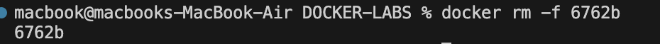

## Run a new container with the following:
### Attach the volume that was attached to the previous container

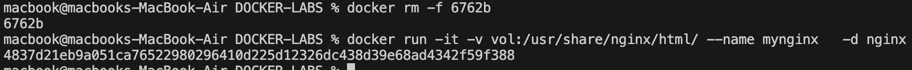

# Bonus

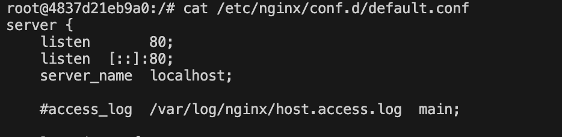

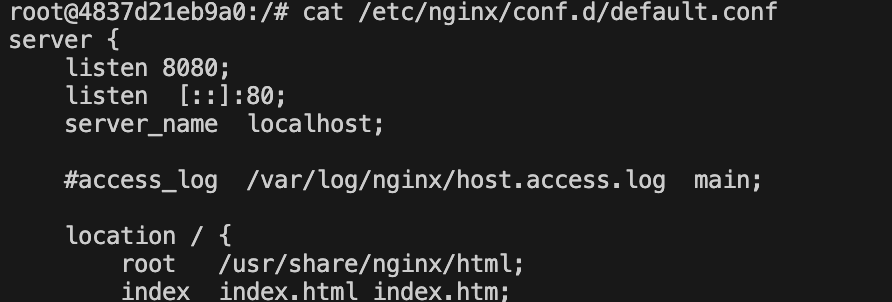

