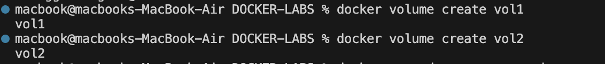
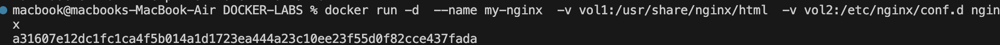
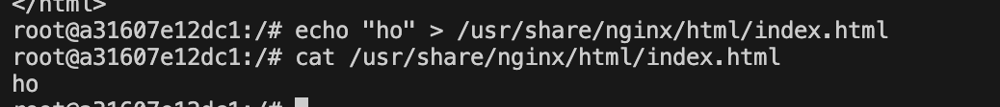
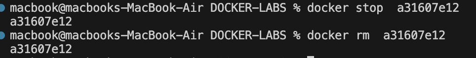
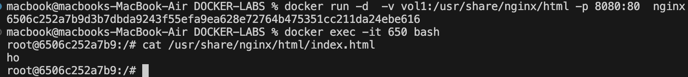
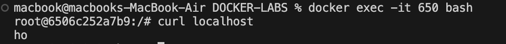
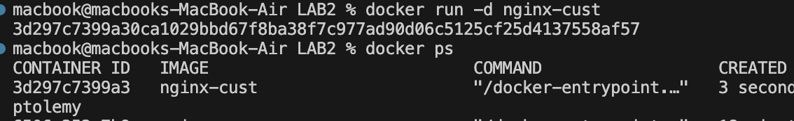
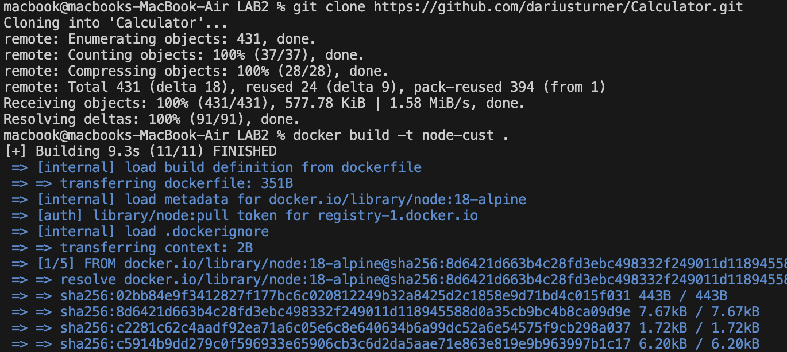
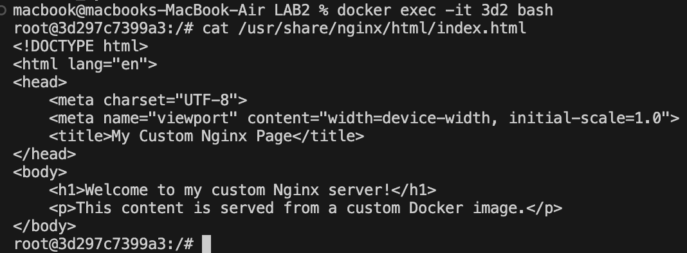
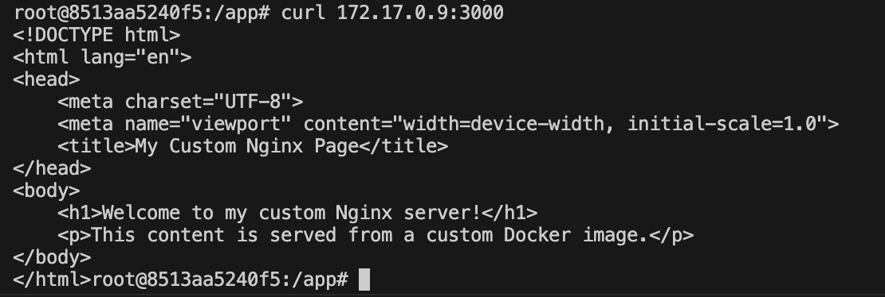

# lab 2#
# **📌Problem 1:**
## Run a container nginx with name my-nginx and attach a and attach a volume 2 volumes
to the container
§ Volume1 for containing static html file
§ Volume2 for containing nginx configuration

📸

📸

📸

📸

📸

📸

# **📌Problem 2:**
## Create a dockerfile for nginx image with different html content and different nginx conf that listen to port 8080 instead of port 80 on the container &  Create container from the new \image

# **📌Problem 3:**

