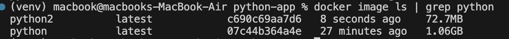
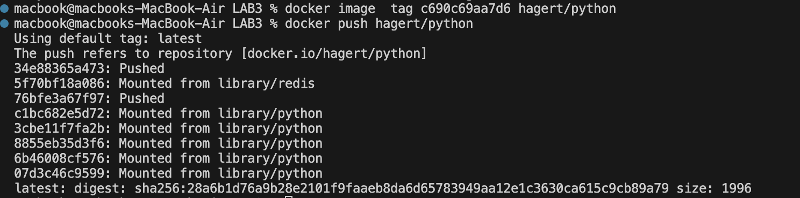
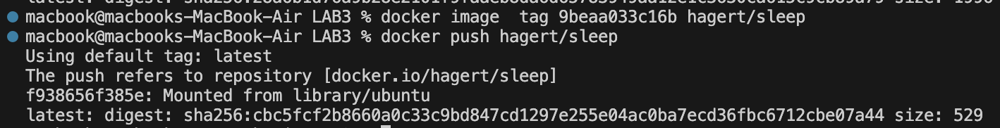
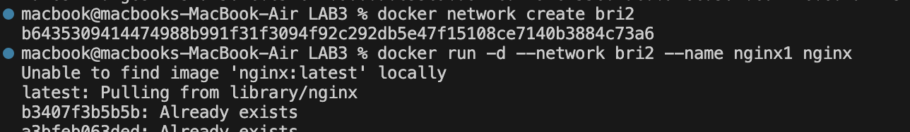
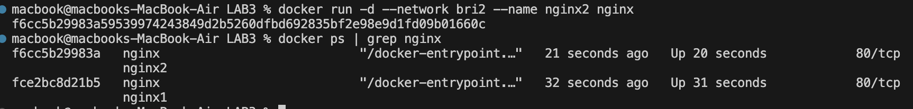
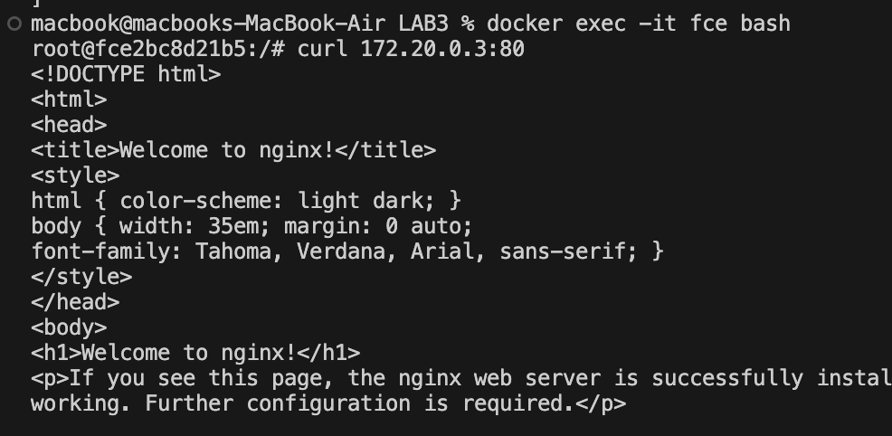
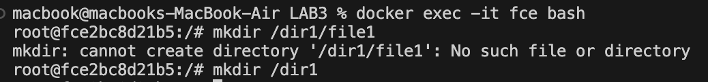
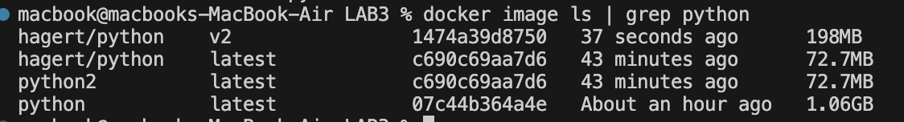
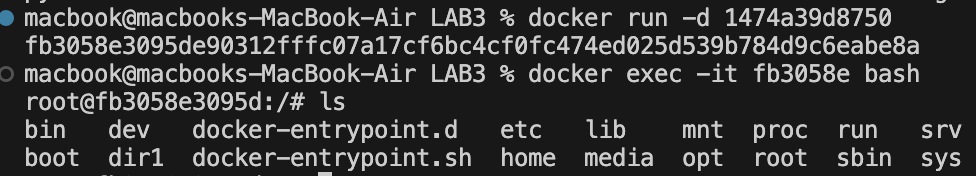

# lab 3#
# **📌Problem 1:**
## Create a reactjs simple app Create a dockerfile to containerize the reactapp Build the image and test it create a dockerfile for the same app in smaller size using multi staging

📸


# **📌Problem 2:**
## Create a dockerfile for ubuntu image which sleeps by default for 5 sec or sleeps according to the given number in the docker command

```bash
FROM ubuntu:latest
ENTRYPOINT ["sleep"]
CMD ["5"]
```

# **📌Problem 3:**
## Push the images created in Problem 1&2 into your docker hub repo





# **📌Problem 4:**
## Create 2 nginx containers with network type bridge, enter to one of them and use curl command to view the ccontent of the other container.







# make commit 








# multi stage
