# complete lab1 #

## **📌8-List Linux commands in /usr/bin that start with letter w** 
📸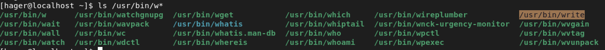

## **📌11-Display the man pages of passwd the command and the file sequentially in one command.** 
📸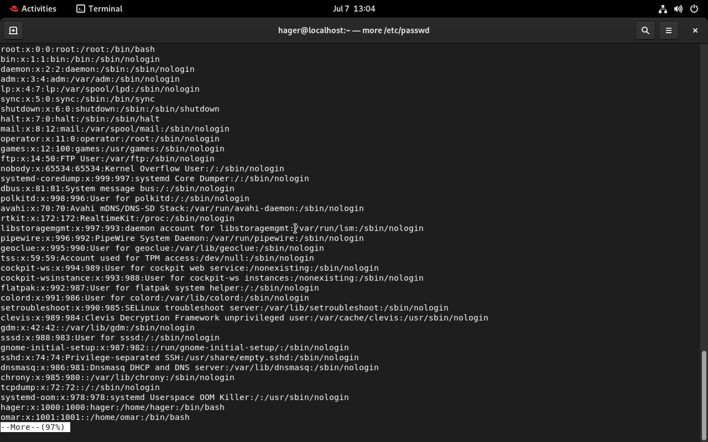
📸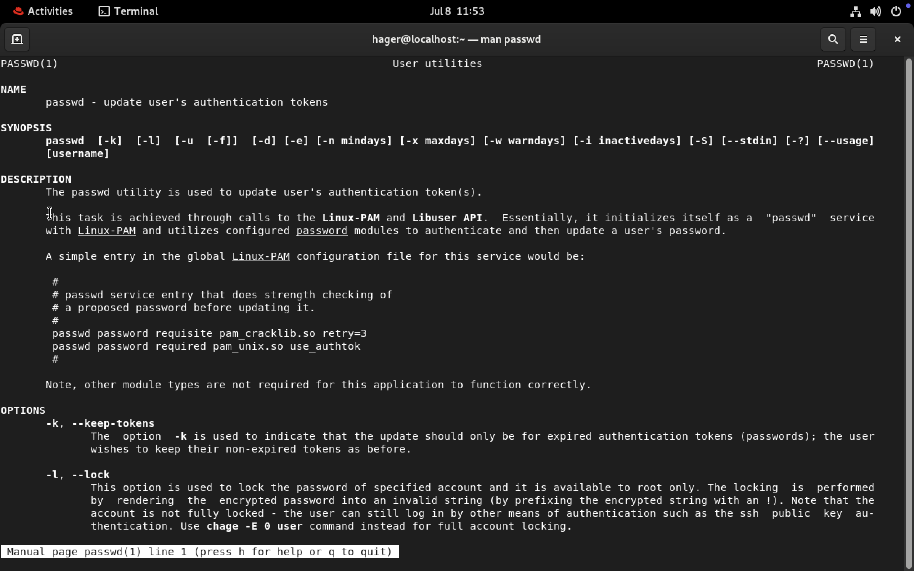
📸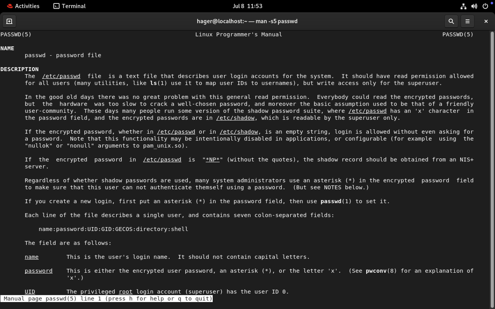

## **📌12- Display the man page of the passwd file.** 
📸
📸

## **📌13- Display a list of all the commands that contain the keyword passwd in their man page.**
📸

# lab2 #

## **📌1-Create a user account with the following attribute     username: islam                                                    Fullname/comment: Islam Askar                                  Password: islam **
📸

## **📌2-Create a user account with the following attribute         Username: baduser                                                 Full name/comment: Bad User                                       Password: baduser**
📸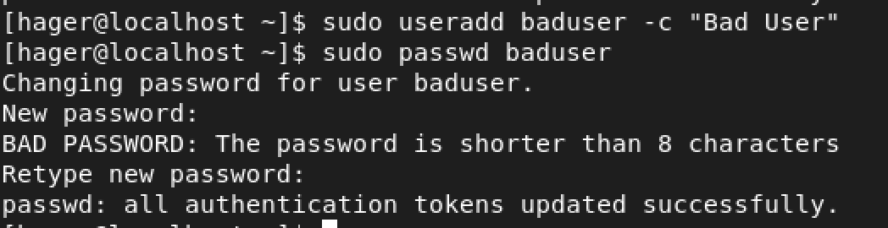

## **📌3-Create a supplementary (Secondary) group called pgroup with group ID of 30000** 
📸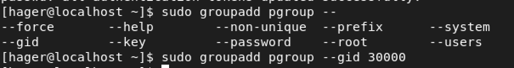

## **📌4-Create a supplementary group called badgroup** 
📸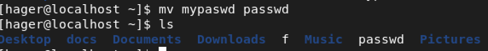

## **📌5-Add islam user to the pgroup group as a supplementary group** 

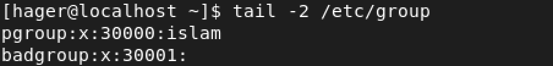

## **📌6-Modify the password of islam's account to password** 
📸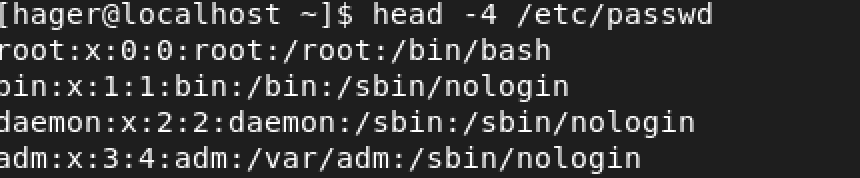

## **📌7-Modify islam's account so the password expires after 30 days** 
📸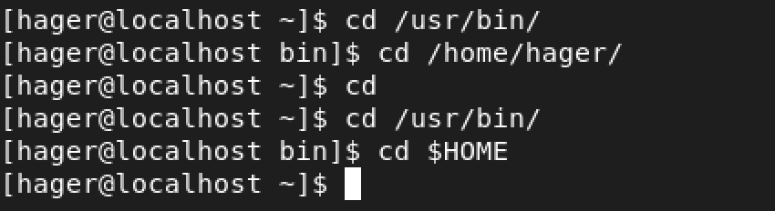

## **📌8-Lock bad user account so he can't log in** 
📸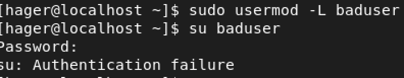

## **📌9-Delete bad user account** 
📸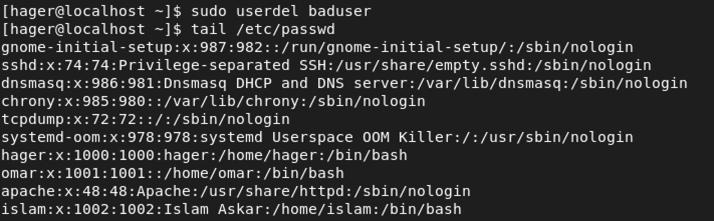

## **📌10-Delete the supplementary group called badgroup.** 
📸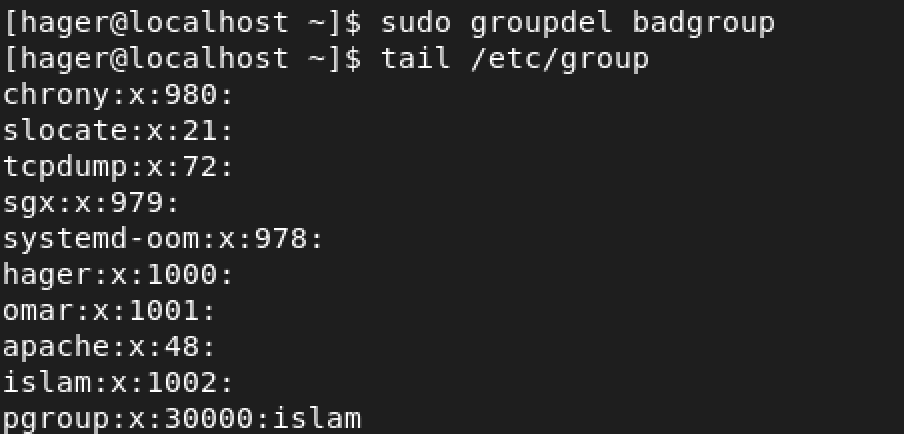