# complete lab2 #

## **📌13-Create a folder called myteam in your home directory and change its permissions to read only for the owner.**
📸

## **📌14-Log out and log in by another user** 
📸

## **📌15-Try to access (by cd command) the folder (myteam)** 
📸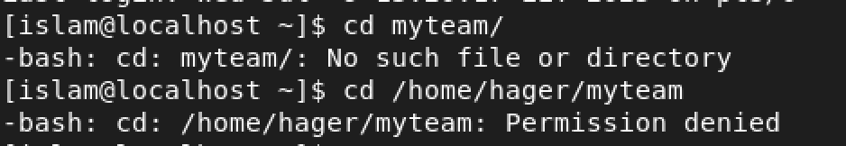

## **📌16-Using the Command Line**
- Change the permissions of `oldpasswd` file to give owner read and write permissions and for group write and execute and execute only for the others (using `chmod` in 2 different ways)
📸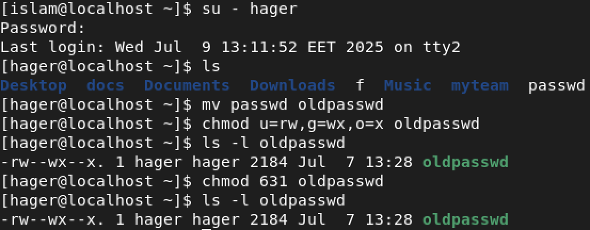

- Change your default permissions to be as above.
(631-777=146)
📸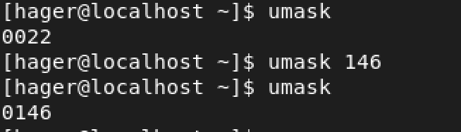

- What is the maximum permission a file can have, by default when it is just created? And what is that for directory.
   ### For Directories:
   777 and after umask for dir 631

   ### For Files:
   666 and after umask (666-146=)for files 520
📸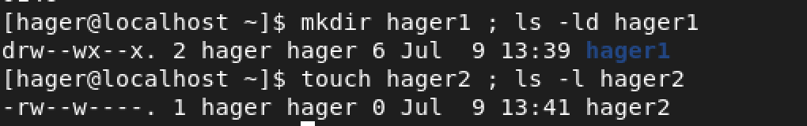

- Change your default permissions to be no permission to everyone then create a directory and a file to verify.
📸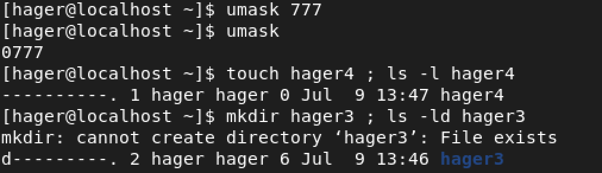

## **📌17-#What are the minimum permission needed for:**
- Copy a directory (permission for source directory and permissions for target parent directory)
### for source >>> rx
### for target >>> wx

- Copy a file (permission for source file and and permission fortarget parentdirectory)
### for source >>> r
### for target >>> wx

- Delete a file
### wx
- Change to a directory
### x
- List a directory content (ls command)
### rx
- View a file content (more/cat command)
### r
- Modify a file content
### w

## **📌18-#Create a file with permission 444. Try to edit in it and to remove it? Note what happened.**
📸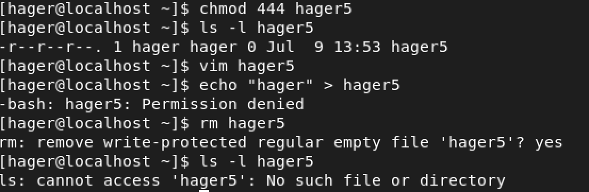
📸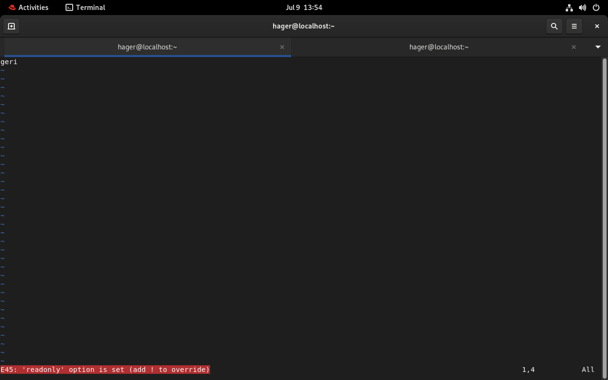

## **📌19-#What is the difference between the “x” permission for a file and for a directory?**
### for file>>> run if it script
### for dir>>> cd in this dir 
=================================
# lab2 #

## **📌1-Using vi write your CV in the file mycv. Your CV should include your name, age, school, college, experience,...**
📸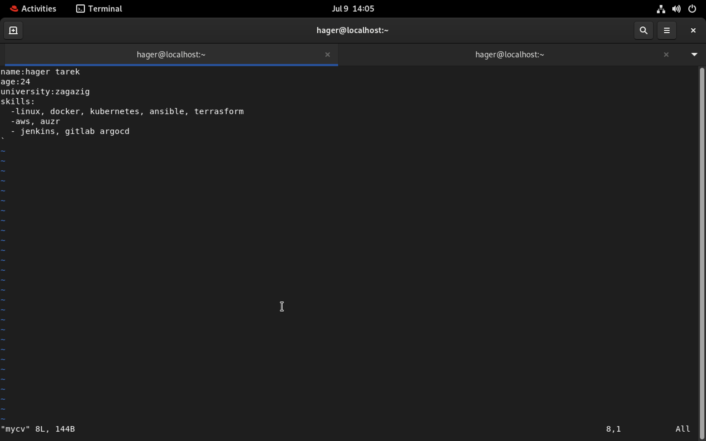

## **📌2-Open mycv file using vi command then: Without using arrows state how to:**
- Move the cursor down one line at time.
### j <in command mode>
- Move the cursor up one line at time.
### k <in command mode>
- Search for word age
### / 
- Step to line 5 (assuming that you are in line 1 and file is more than 5 lines).
### :set nu + enter 
### 5G <in command mode>
- Delete the line you are on and line 5.
### :.,5d
- How to step to the end of line and change to writing mode in one-step.
### A <in command mode>
📸

## **📌3-List the available shells in your system.** 
📸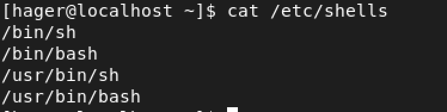

## **📌4-List the environment variables in your current shell.** 
📸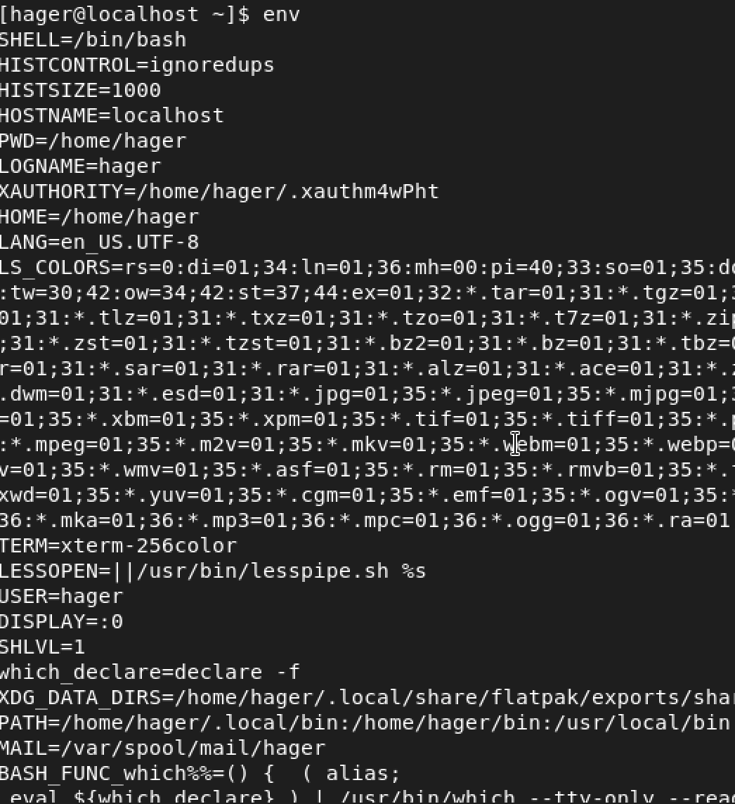
or cat ~/.profile or cat ~/.bashrc
## **📌5-List all of the environment variables for the bash shell.** 
~/man bash
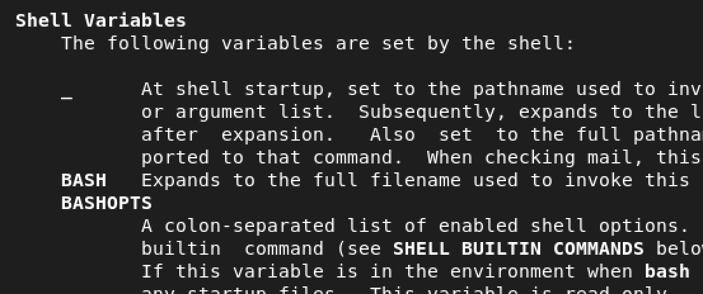

## **📌6-What are the commands that list the value of a specific variable?** 
~/echo $HOME
## **📌7-Display your current shell name.** 
~/echo $BASH
## **📌8-State the initialization files of: sh, ksh, bash.** 

This table summarizes the initialization files used by different shells during login and non-login sessions.

| Shell  | Login Shell Files                                             | Non-login Shell Files                    |
|--------|---------------------------------------------------------------|------------------------------------------|
| `sh`   | `/etc/profile`, then `~/.profile`                             | ----                      |
| `ksh`  | `/etc/profile`, then `~/.profile`                             | `~/.kshrc`   |
| `bash` | `/etc/profile`, then the : `~/.bash_profile`(have the higher periority),`~/.profile` | `~/.bashrc`                               |

## **📌9-Edit in your profile to display date at login and change your prompt permanently.** 
📸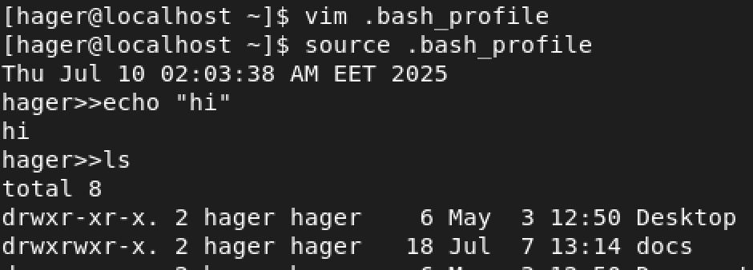
📸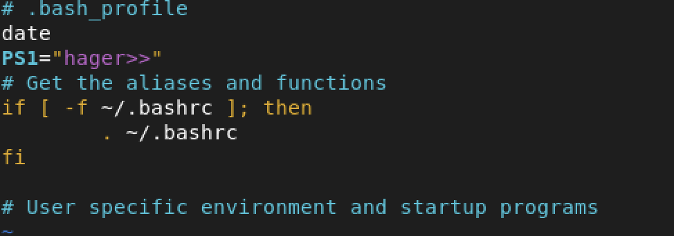

## **📌10- Execute the following command :**
echo \ then press enter
What is the purpose of \ ?
Notice the prompt ”>” what is that? and how can you change it from “>” to “:”. 

### 1-it to complete yor command but in new line 

### 2-to change it search in man about the env variable for prompt by using ~/man bash or ~/compgen -v  
📸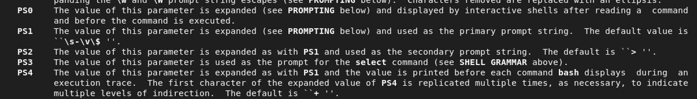
📸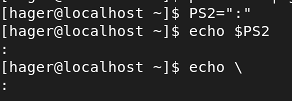

## **📌11-. Create a Bash shell alias named ls for the “ls –l” command** 
📸