# lab4 #

## **📌1-List the user commands and redirect the output to /tmp/commands.list**
📸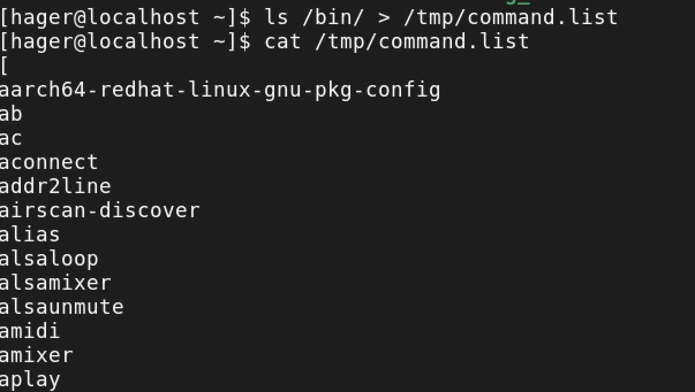

## **📌2-Count the number of user commands**
📸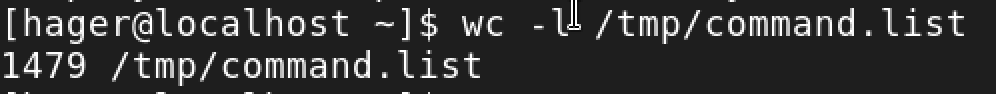

## **📌3-Get all the users names whose first character in their login is ‘g’.** 
📸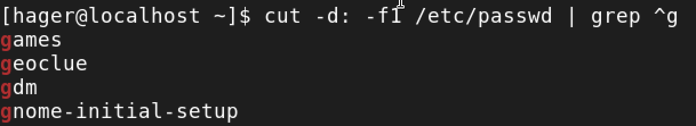

## **📌4-Get the logins name and full names (comment) of logins starts with “g”.** 
📸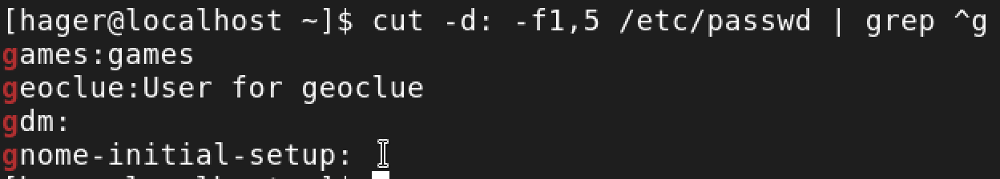
## **📌5-Save the output of the last command sorted by their full names in a file.** 
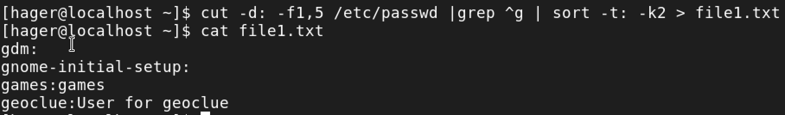

## **📌6-Write two commands: first: to search for all files on the system that named .bash_profile. Second: sorts the output of ls command on / recursively, Saving their output and error in 2 different files and sending them to the background.** 
### first

### Second
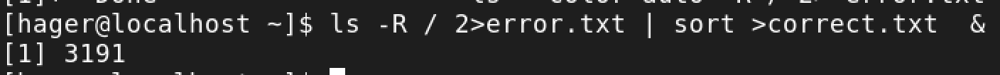

## **📌7-Display the number of users who is logged now to the system.** 
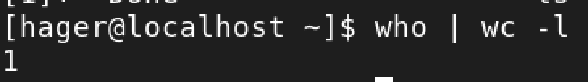
## **📌8-Display lines 7 to line 10 of /etc/passwd file** 
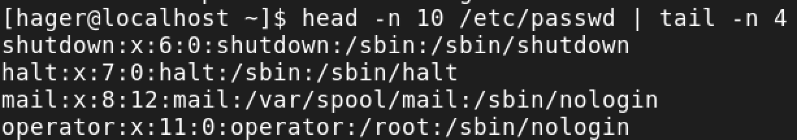

## **📌9-What happens if you execute:**
- cat filename1 | cat filename2  >> display only the second cat 
- ls | rm >>  waiting arrgument for rm 
- ls /etc/passwd | wc –l >> list only the file /etc/passwd so it only count it 

## **📌10-Issue the command sleep 100.**
run in forground so cant use the terminal 
## **📌11- Stop the last command.**
control + z
## **📌12- Resume the last command in the background**
bg
## **📌13-Issue the jobs command and see its output.** 
it will show the it running 
## **📌14- Send the sleep command to the foreground and send it again to the background.** 
bg %1 fg%1
## **📌15-Kill the sleep command.**
kill %1
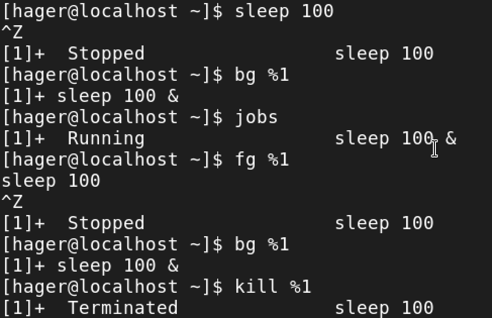

## **📌16- Display your processes only**
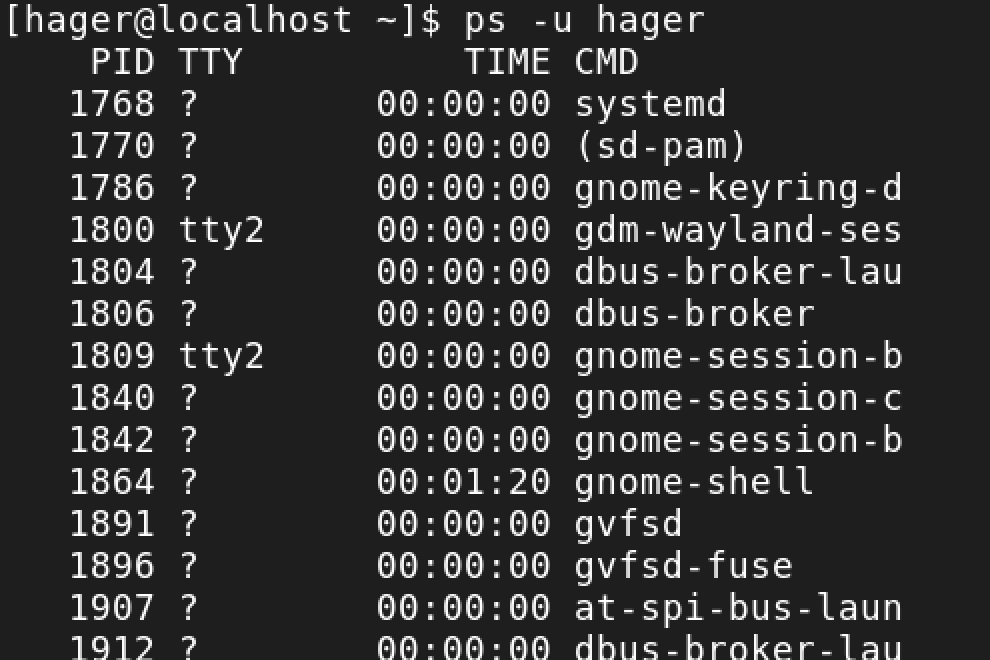

## **📌17- Display all processes except yours**
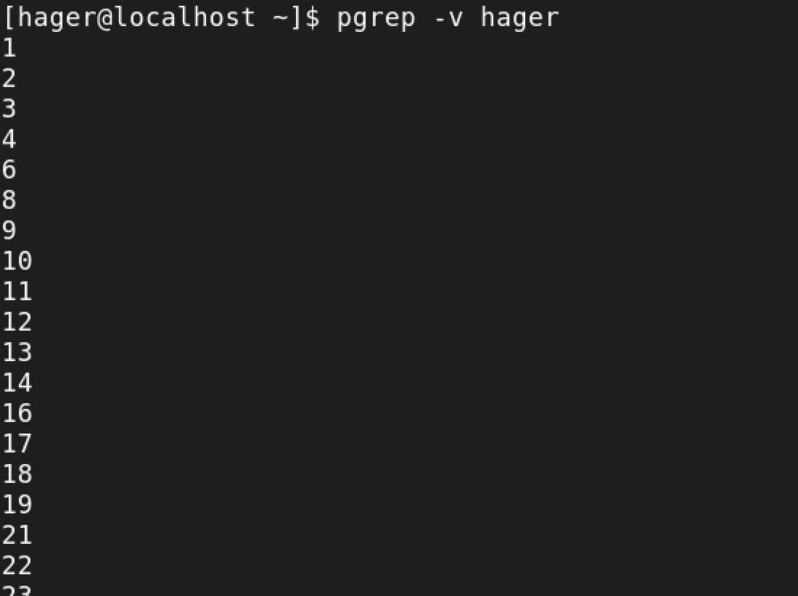

## **📌18-Use the pgrep command to list your processes only**
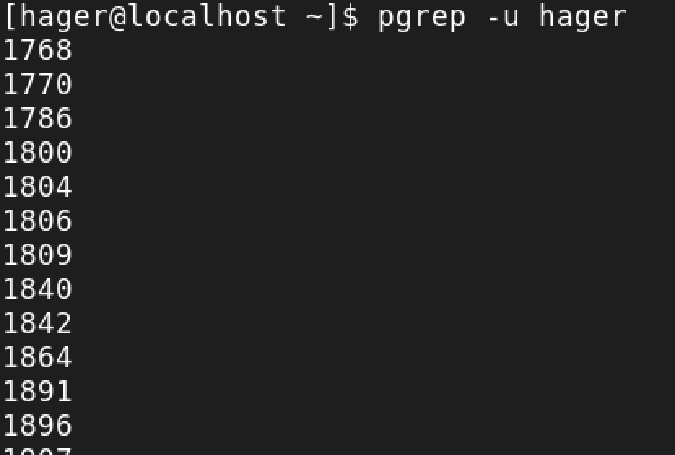
