# lab5 #

## **📌1-Compress a file by compress, gzip, zip commands and decompress it again. State the differences between compress and gzip commands**
we will work on error.txt file
📸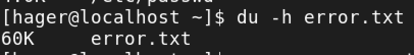

1-compress: not reduce file size -- replace the file with **file.z** -- can read using **zcat file.z** to decompress **uncompress file.z**
2-gzip: more powerful tool reduce the file size more than compress 
📸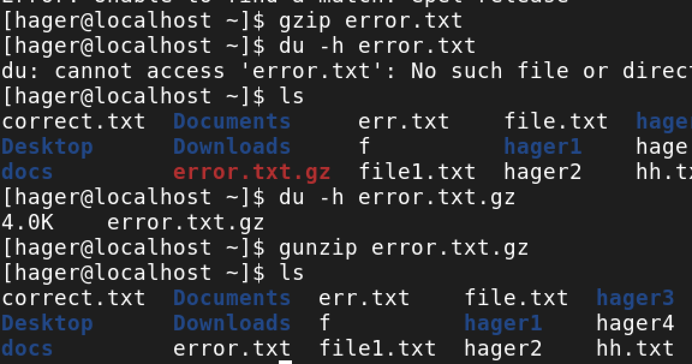
3-zip: not repleace the file as gzip ut it create another zip file and reduce the file size more than gzip 
📸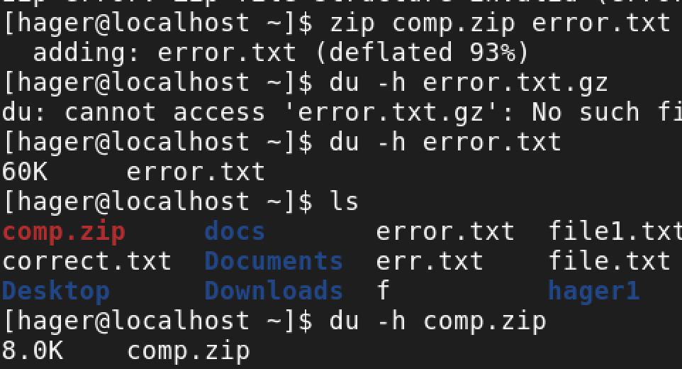

## **📌2-What is the command used to view the content of a compressed file**
zcat 

## **📌3-Backup /etc directory using tar utility** 
📸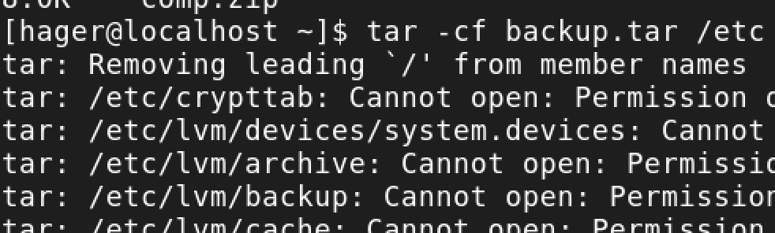
📸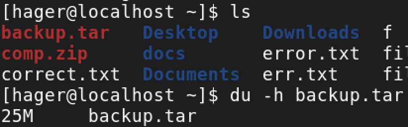

## **📌4-Starting from your home directory, find all files that were modified in the last two day.** 
📸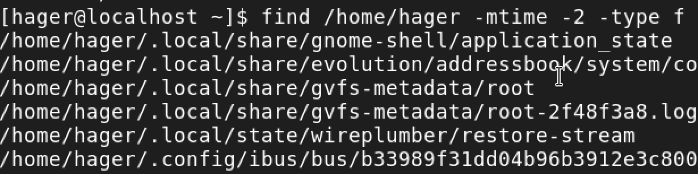

## **📌5-Starting from /etc, find files owned by root user.** 
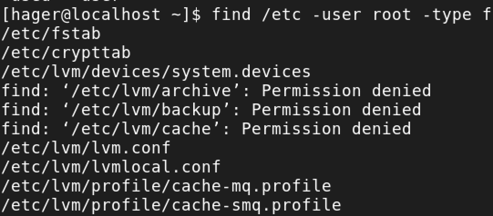

## **📌6-Find all directories in your home directory.** 
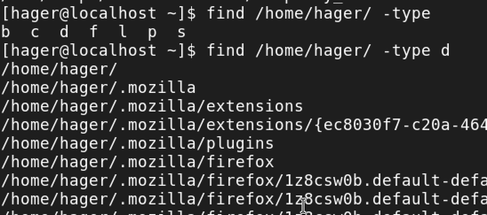

## **📌7-Write a command to search for all files on the system that, its name is “.profile”.** 

## **📌8-Identify the file types of the following: /etc/passwd, /dev/pts/0, /etc, /dev/sda** 
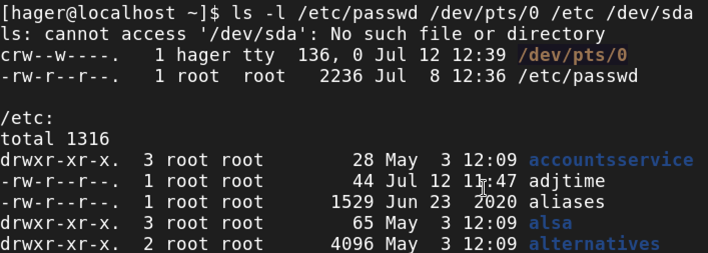
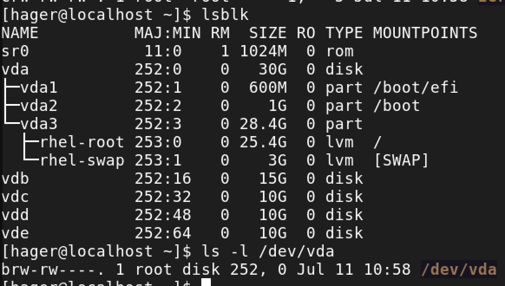

## **📌9-List the inode numbers of /, /etc, /etc/hosts.**

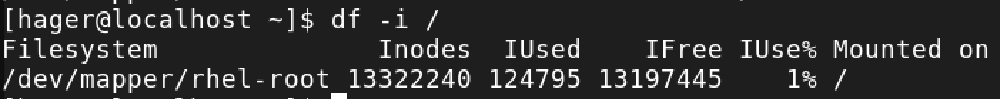

## **📌10-Copy /etc/passwd to your home directory, use the commands diff and cmp, and Edit in the file you copied, and then use these commands again, and check the output.**
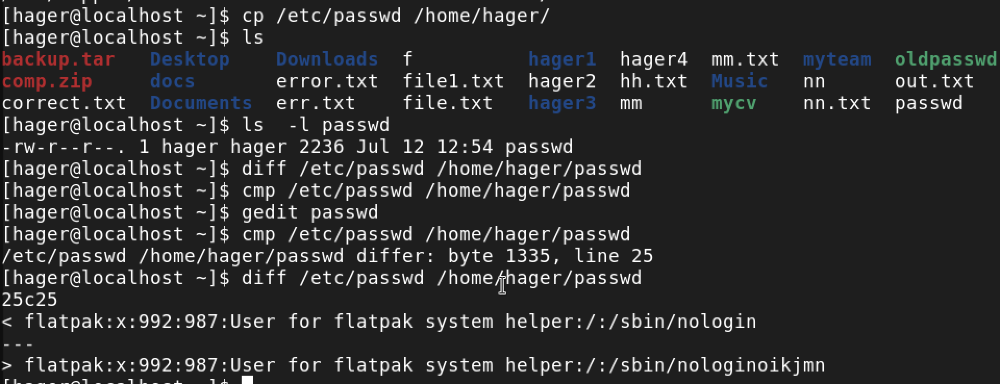

## **📌11-Create a symbolic link of /etc/passwd in /boot.**
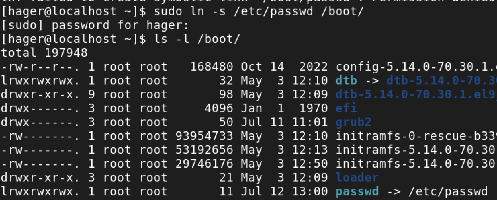
## **📌12-Create a hard link of /etc/passwd in /boot. Could you? Why?**

diff hard disk so diff fs and in hardlink cannot make in diff fs otherwise in softlink
