## **📌2- What is the difference between cat and more command?** 
cat==>display all file content
📸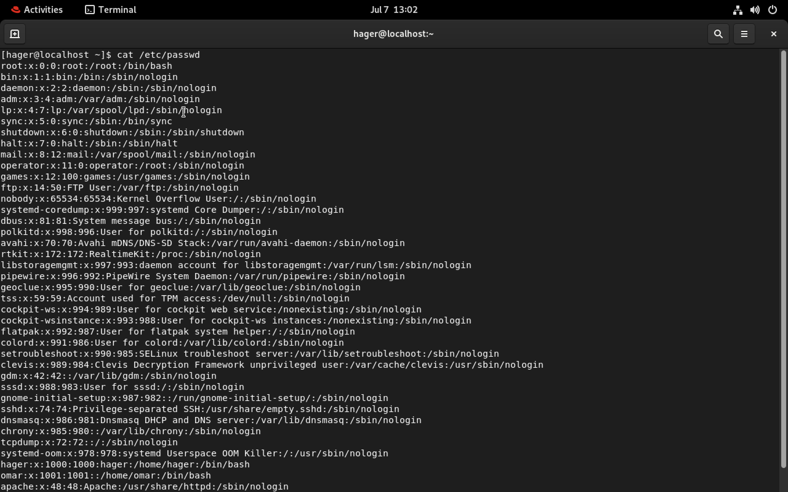

more==>display one page at a time
📸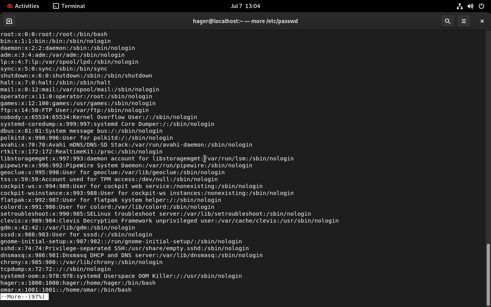

## **📌3- What is the difference between cat and more command?** 
rm
📸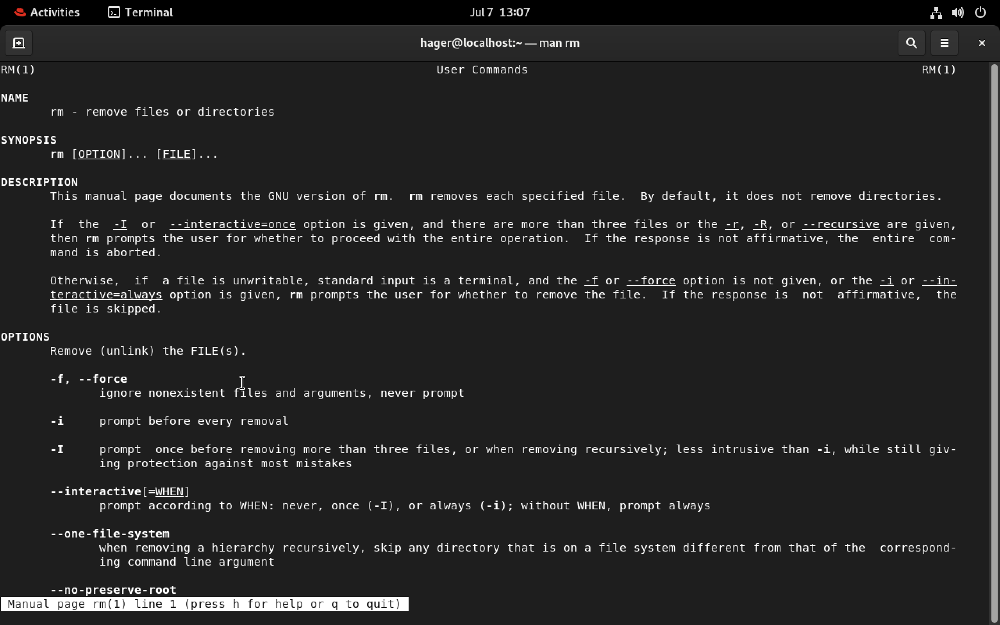

rmdir
📸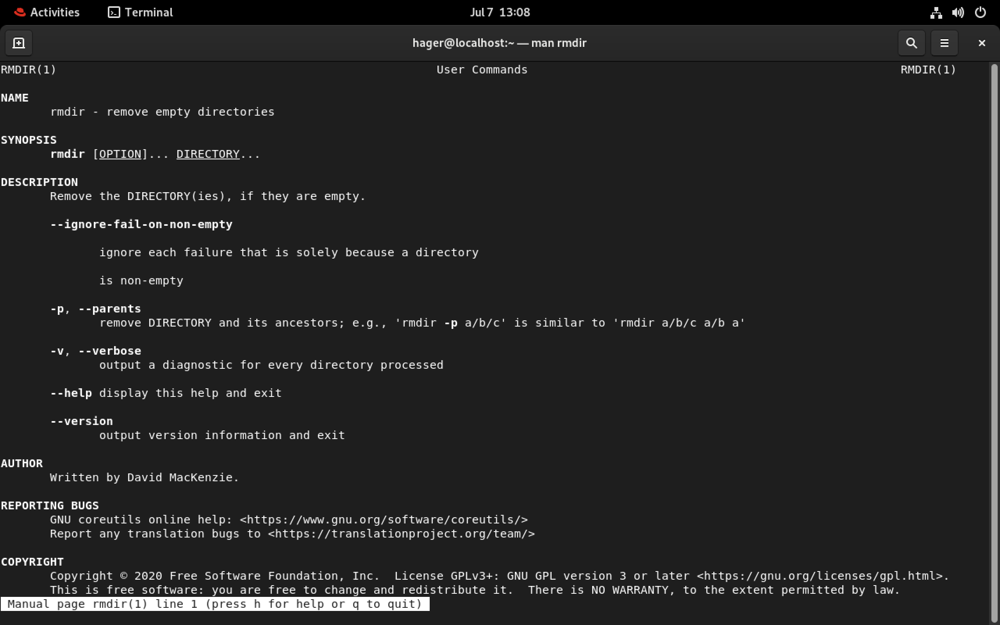

## **📌4- Create the following hierarchy under your home directory:** 
📸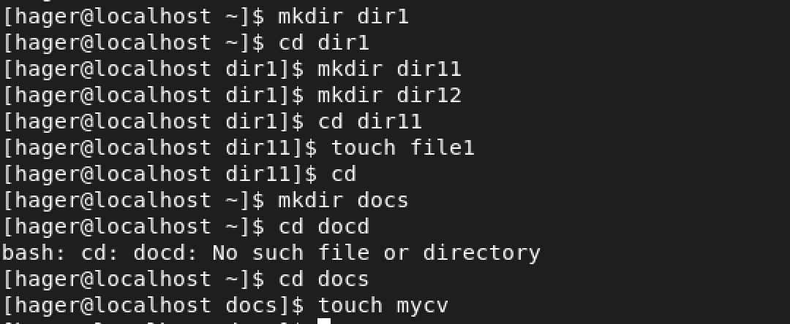

### a-Remove dir11 in one-step. What did you notice? And how did you overcome that? ###
📸

### b-Then remove dir12 using rmdir –p command. State what happened to the hierarchy (Note: you are in your home directory).###
📸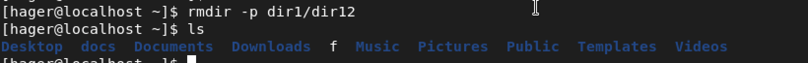

### c-The output of the command pwd was /home/user. Write the absolute and relative path for the file mycv###
📸
📸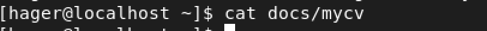

## **📌5-Copy the /etc/passwd file to your home directory making its name is mypasswd.** 
📸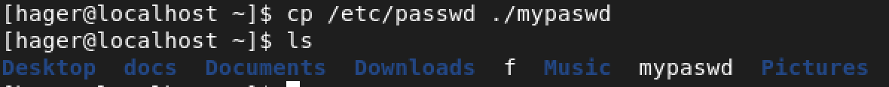

## **📌6-Rename this new file to be oldpasswd.** 
📸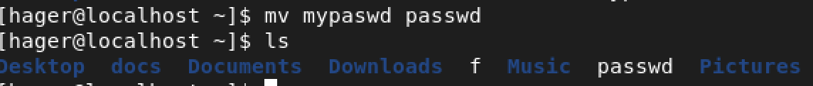

## **📌7-You are in /usr/bin, list four ways to go to your home directory** 
📸

## **📌9-Display the first 4 lines of /etc/passwd** 
📸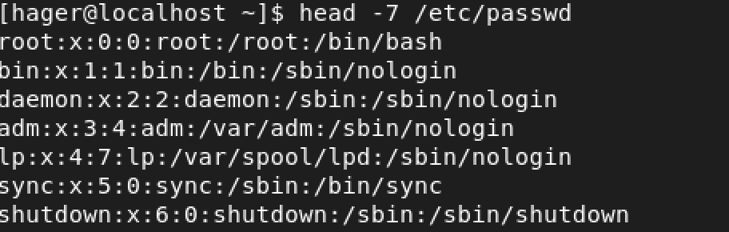

## **📌10-Display the first 7 lines of /etc/passwd** 
📸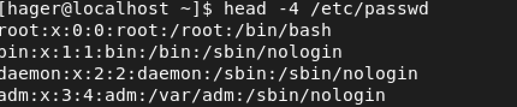