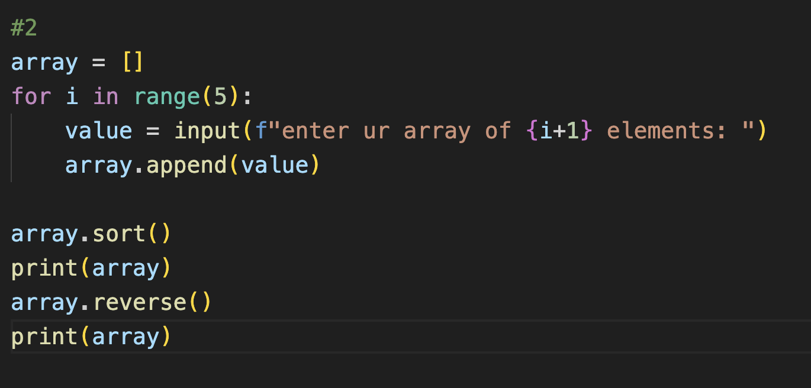

# lab1 #
# **📌Problem 1:
## Write a program that counts up the number of vowels [a, e, i, o,u] contained in the string.

📸

📸

# **📌Problem 2:**
## Fill an array of 5 elements from the user, Sort it in descending and ascending orders then display the output.

📸

📸

# **📌Problem 3:**
## Write a program that prints the number of times the string 'iti' occurs in anystring.

📸

📸

# **📌Problem 4:**

## Write a program that remove all vowels from the input word and generate a brief version of it.

# **📌Problem 5:**

## Write a program that prints the locations of "i" character in string you added.

# **📌Problem 6:**

## Write a program that generate a multiplication table from 1 to the number passed.

# **📌Problem 7:**

## Write a program that build a Mario pyramid like below:

