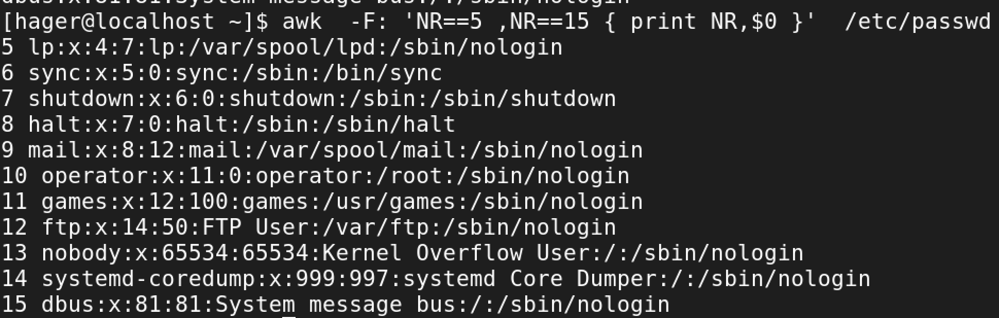

# lab1 #
# Using sed utility # 
## **📌1- Display the lines that contain the word “lp” in /etc/passwd file.**
📸

## **📌2-Display /etc/passwd file except the third line.**
📸

## **📌3-Display /etc/passwd file except the last line.** 
📸

## **📌4-Display /etc/passwd file except the lines that contain the word “lp”.** 
📸
## **📌5-Substitute all the words that contain “lp” with “mylp” in /etc/passwd file.** 

# Using awk utility # 

## **📌1-Print full name (comment) of all users in the system.** 

## **📌2-Print login, full name (comment) and home directory of all users.( Print each line preceded** 

## **📌3-Print login, uid and full name (comment) of those uid is greater than 500** 

## **📌4-Print login, uid and full name (comment) of those uid is exactly 500**

 **📌5-Print line from 5 to 15 from /etc/passwd**

or 
awk -F: '
{
      if(NR >=5 && NR <=15)
      print $0
}
' /etc/passwd
## **📌6-Change lp to mylp**

or 
awk -F: '
{
  i=i
  while(i <= NF){
    if($i == "lp"){
      $i == "mylp"  
    }
    i++;
  }  
}
'

## **📌7-Print all information about greatest uid.**

## **📌8-Get the sum of all accounts id’s.**

