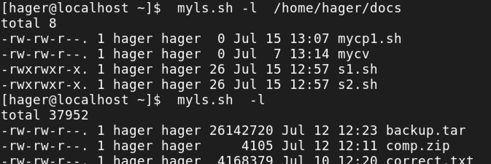
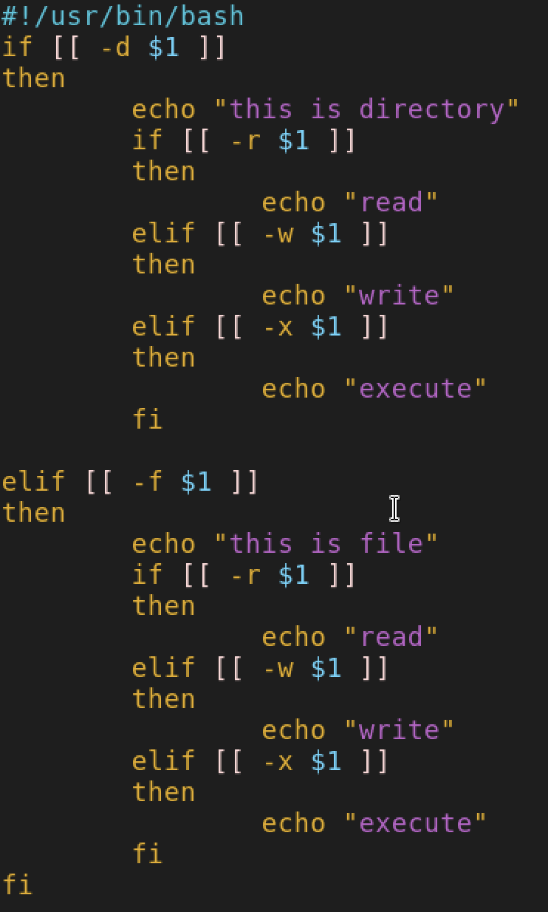
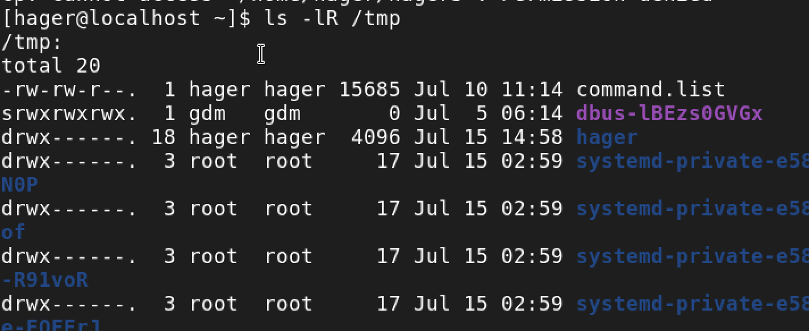
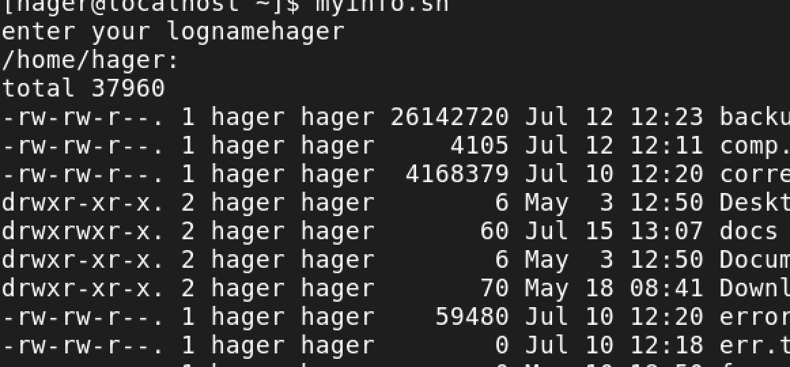
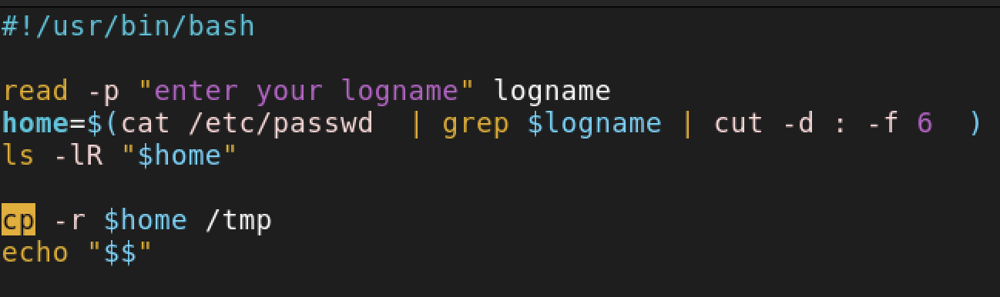

# lab2 
## **📌1-Create a script that asks for user name then send a greeting to him.**
📸
📸

## **📌2-Create a script called s1 that calls another script s2 where:**
### a. In s1 there is a variable called x, it's value 5
## b. Try to print the value of x in s2 by two different ways.
📸
📸
📸

## **📌3-Create a script called mycd where:**
### a.It copies a file to another
### b.It copies multiple files to a directory.

## **📌4-Create a script called mycd where:**
### a. It changed directory to the user home directory, if it is called without argur
### b. Otherwise, it change directory to the given directory.

## **📌5-Create a script called myls where:**
### a. It lists the current directory, if it is called without arguments.
### b. Otherwise, it lists the given directory.

## **📌6-Enhance the above script to support the following options individually:**
### a. -I: list in long format
### b. -a: list all entries including the hiding files.
### c. -d: if an argument is a directory, list only its name
### d. -i: print inode number
### e. -R: recursively list subdirectories

## **📌7-Create a script called mytest where:**
### a. It check the type of the given argument (file/directory)
### b. It check the permissions of the given argument (read/write/execute)

## **📌8-Create a script called myinfo where:
### a. It asks the user about his/ her logname.
### b. It print full into about files and directories in his/her home directory
### c. Copy his/her files and directories as much as you can in / tmp directory.
### d. Gets his current processes status.** 

to show the current process should run script with source myinfo

