# lab2 #
## **📌1-Create a script that asks for user name then send a greeting to him.**
📸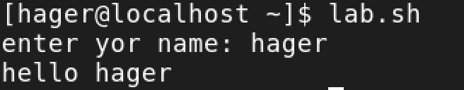
📸

## **📌2-Create a script called s1 that calls another script s2 where:**
### a. In s1 there is a variable called x, it's value 5
## b. Try to print the value of x in s2 by two different ways.
📸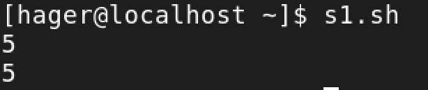
📸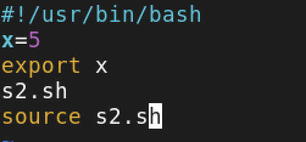
📸

## **📌3-Create a script called mycd where:**
### a.It copies a file to another
### b.It copies multiple files to a directory.
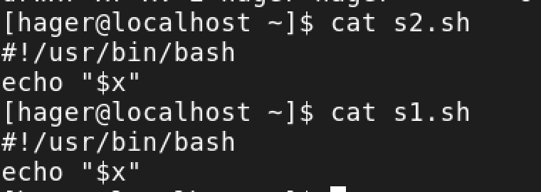
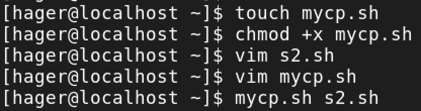
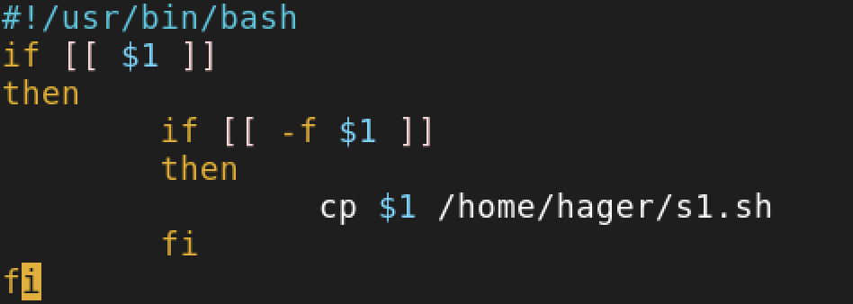
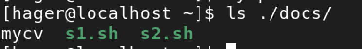
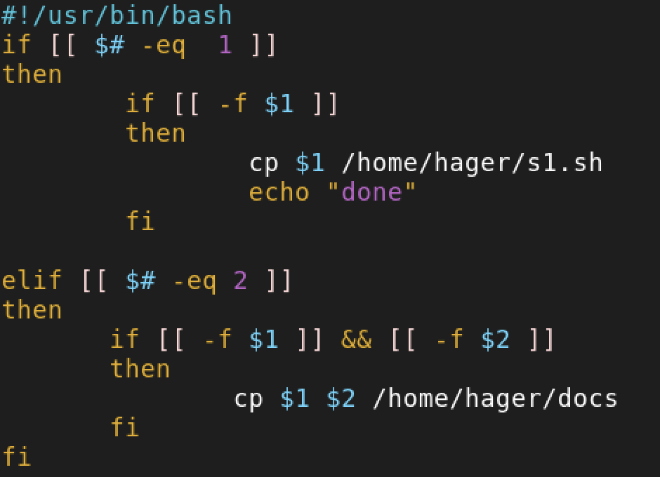

## **📌4-Create a script called mycd where:**
### a. It changed directory to the user home directory, if it is called without argur
### b. Otherwise, it change directory to the given directory.
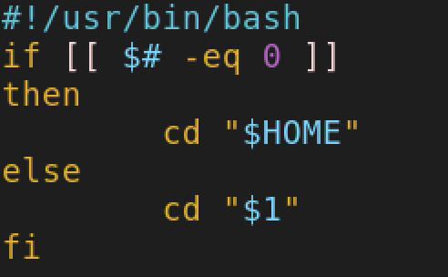
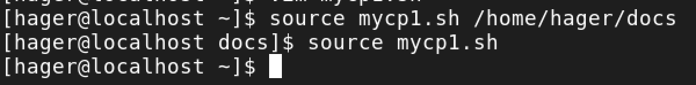

## **📌5-Create a script called myls where:**
### a. It lists the current directory, if it is called without arguments.
### b. Otherwise, it lists the given directory.
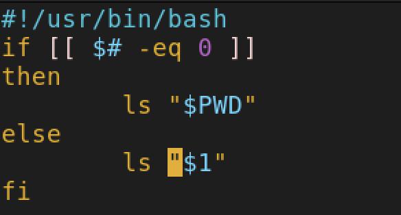
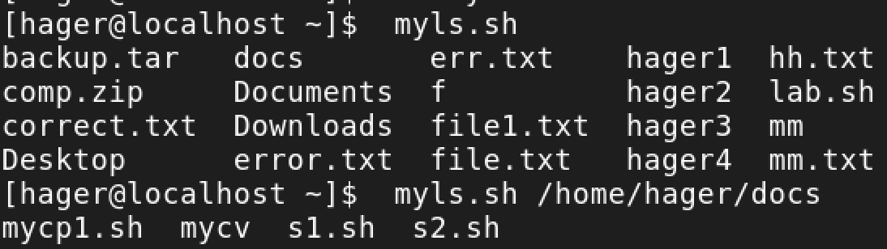

## **📌6-Enhance the above script to support the following options individually:**
### a. -I: list in long format
### b. -a: list all entries including the hiding files.
### c. -d: if an argument is a directory, list only its name
### d. -i: print inode number
### e. -R: recursively list subdirectories

## **📌2-Print login, full name (comment) and home directory of all users.( Print each line preceded** 

## **📌3-Print login, uid and full name (comment) of those uid is greater than 500** 

## **📌4-Print login, uid and full name (comment) of those uid is exactly 500**

 **📌5-Print line from 5 to 15 from /etc/passwd**

or 
awk -F: '
{
      if(NR >=5 && NR <=15)
      print $0
}
' /etc/passwd
## **📌6-Change lp to mylp**
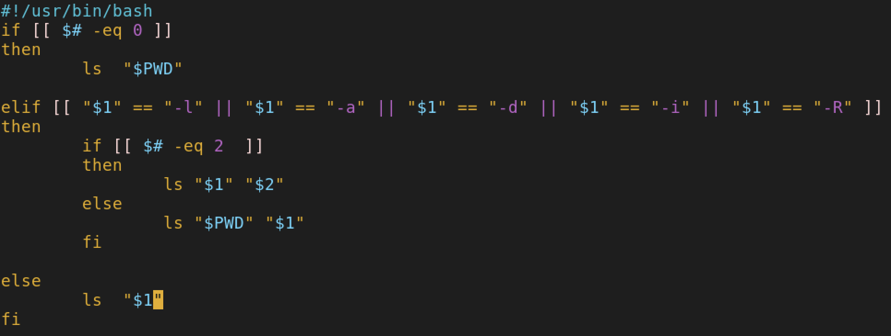
or 
awk -F: '
{
  i=i
  while(i <= NF){
    if($i == "lp"){
      $i == "mylp"  
    }
    i++;
  }  
}
'

## **📌7-Print all information about greatest uid.**

## **📌8-Get the sum of all accounts id’s.**

